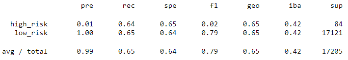
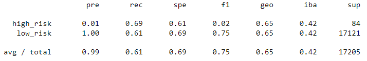
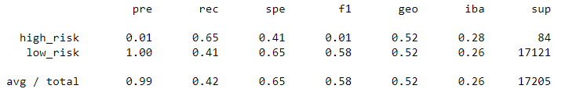
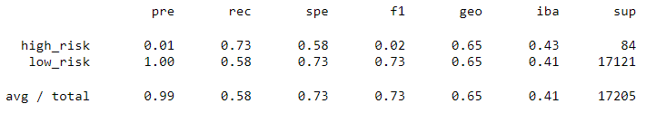
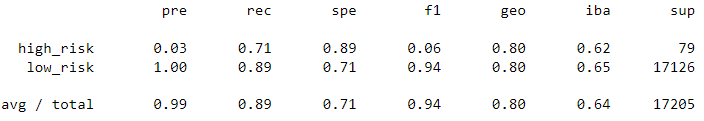
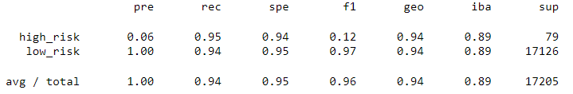

# Credit_Risk_Analysis

## Overview

### Purpose

The purpose of this analysis is to apply machine learning to evaluate credit risk.

## Results

### Balanced Accuracy, Precision and Recall

* Naive Random Oversampling
    - Accuracy Score: 0.6489211244336529
    - High Risk Precision: 0.01
    - High Risk Recall: 0.64
    - High Risk F1: 0.02

* SMOTE
    - Accuracy Score: 0.6483453903727252
    - High Risk Precision: 0.01
    - High Risk Recall: 0.69
    - High Risk F1: 0.02

* Undersampling
    - Accuracy Score: 0.5343197994109156
    - High Risk Precision: 0.01
    - High Risk Recall: 0.65
    - High Risk F1: 0.01

* SMOTEENN
    - Accuracy Score: 0.6518342136223685
    - High Risk Precision: 0.01
    - High Risk Recall: 0.73
    - High Risk F1: 0.02

* Balanced Random Forest Classifier
    - Accuracy Score: 0.8012072102968764
    - High Risk Precision: 0.03
    - High Risk Recall: 0.71
    - High Risk F1: 0.06

* Easy Ensemble AdaBoost Classifier
    - Accuracy Score: 0.9425686313060163
    - High Risk Precision: 0.06
    - High Risk Recall: 0.95
    - High Risk F1: 0.12

## Summary

Six machine learning models were created with varying sampling techniques. Among these, the accuracy scores ranged from 0.53 to 0.94. Most models had a precision of about 0.1, the recall for all models averaged about 0.73 and the F1 scores ranged from 0.01 to 0.16. The Easy Ensemble AdaBoost Classifier had the highest values for all four metrics summarized in the results section.

### Recommendation

In this inherently unbalanced classification problem, a model should prioritize precision over all other metrics to avoid false negatives. Because the precision in all six models that were tested was very low, none of the above are recommended for use in the credit risk application.
